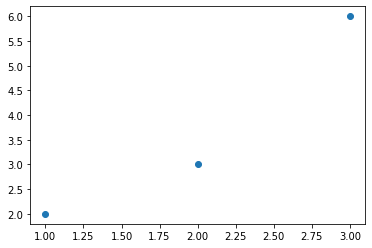

Plots graph for given array 

- Use `numpy and pyplot` for plotting
- Import using `import numpy`, `from matplotlib import pyplot`

```py
def plot_array():
  data = numpy.array([
    [1, 2],
    [2, 3],
    [3, 6],
])
x, y = data.T  #transpose 
plt.plot(x,y)
plt.show()
```
```py
plot_array() 
```

